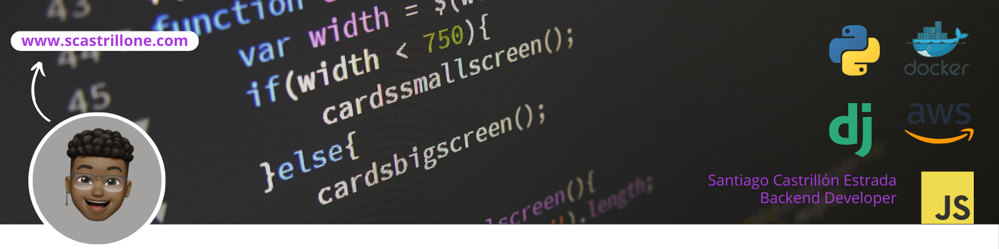

<h2>Hola, Soy Santiago</h2>

Soy un ingeniero backend con 5 años
de experiencia, especializado en
Python. He colaborado en proyectos
FinTech, incluyendo refactorización
a Diseño Guiado por Dominio (DDD) y
participación
en
procesos
para
obtener licencias financieras. Con
habilidades en Django, PostgreSQL,
Azure DevOps y servicios de Amazon,
proporciono soluciones efectivas y
actualizadas.

<!-- ## 👋 &nbsp;Hola, Soy Santiago -->
### 👨🏻‍💻 &nbsp;Sobre mi

💡 &nbsp;Me gusta explorar tecnologías emergentes e implementar soluciones innovadoras.\
🌱 &nbsp;Estoy en camino de aprender más sobre  Diseño de Sistemas y Arquitectura de Nube.\
✍️ &nbsp;En mi tiempo libre, me dedico a el Gimnasio.\
💬 &nbsp;Siéntase libre de contactarme para consultoría profesional voluntaria, o simplemente para mantener una interesante discusión.\
✉️ &nbsp;¡Puedes enviarme un correo electrónico a <santiagocastrillon.ep@gmail.com>! Intentaré responder tan pronto como pueda.\
📄 &nbsp;Eche un vistazo a mi [CV](https://scastrillone.com/) para obtener más detalles sobre mí. ¡Estoy abierto a comentarios y sugerencias!

### 🛠 &nbsp;Stack Tecnológico

#### Lenguajes

&nbsp;
&nbsp;

#### Frameworks

&nbsp;

#### Bases de datos

&nbsp;

#### Herramientas

&nbsp;
&nbsp;
&nbsp;
&nbsp;
&nbsp;
&nbsp;
&nbsp;

### ⚙️ &nbsp;Indicadores de GitHub

### 🤝🏻 &nbsp;Comunicación abierta

-----

Last Edited on: 25/01/2024
